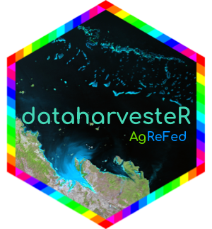

<!-- README.md is generated from README.Rmd. Please edit that file -->



------------------------------------------------------------------------

<!-- badges: start -->

[](#license)
[](https://github.com/Sydney-Informatics-Hub/dataharvester/actions/workflows/pkgdown.yaml)
[](https://github.com/Sydney-Informatics-Hub/dataharvester/issues)
[](https://github.com/Sydney-Informatics-Hub/dataharvester/actions/workflows/R-CMD-check.yaml)
[](https://app.codecov.io/gh/Sydney-Informatics-Hub/dataharvester?branch=main)
<!-- badges: end -->

------------------------------------------------------------------------

**Important: This is a pre-release version of `dataharvester` which is
undergoing active development. Please report any bugs in the
[issues](https://github.com/Sydney-Informatics-Hub/dataharvester/issues)
tab.**

`dataharvester` is an R interface to the
[AgReFed](https://www.agrefed.org.au/) Geodata-Harvester. Use
`dataharvester` to preprocess, aggregate, visualise and download
geospatial data from a range of **Australian** (and international) data
sources, including:

- [Soil and Landscape Grid of Australia (SLGA)](https://is.gd/i8nF0Z)
- [SILO Climate Database - Queensland Government,
  Australia](https://is.gd/ifJ8tB)
- [Digital Elevation Model (DEM) of Australia](https://is.gd/ZLFwGs)
- [Digital Earth Australia (DEA) Geoscience Earth
  Observations](https://is.gd/gRSlVG)
- [GSKY Data Server for DEA Geoscience Earth
  Observations](https://is.gd/zFHxfD)
- [Google Earth Engine](https://is.gd/VdO3Jx)

With connectivity to the Earth Engine API, perform petabyte-scale
operations which include temporal cloud/shadow masking and automatic
calculation of spectral indices (e.g. NDVI) for the following
collections:

- Landsat
  [5](https://developers.google.com/earth-engine/datasets/catalog/landsat-5)
  (TM),
  [7](https://developers.google.com/earth-engine/datasets/catalog/landsat-7)
  (ETM+),
  [8](https://developers.google.com/earth-engine/datasets/catalog/landsat-8)
  (OLI/TRS) and
  [9](https://developers.google.com/earth-engine/datasets/catalog/landsat-9)
  (OLI-2/TRS-2)
- [Sentinel-2](https://developers.google.com/earth-engine/datasets/catalog/sentinel-2)
  (Surface Reflectance) and
  [Sentinel-3](https://developers.google.com/earth-engine/datasets/catalog/COPERNICUS_S3_OLCI)
  (Ocean and Land Colour Instrument)
- [MODIS](https://developers.google.com/earth-engine/datasets/catalog/modis)
  (or Moderate Resolution Imaging Spectroradiometer) products

For [all other Earth Engine
collections](https://developers.google.com/earth-engine/datasets/),
while `dataharvester` does not provide officual support, users can still
perform basic operations to filter, reduce, visualise and download data.

## Demo

Below is an output when the following 3 lines of code is run on a
configuration file, which downloads 16 images from 7 API sources:

``` r
library(dataharvester)
initialise_harvester("r-reticulate")
harvest("~/Documents/democonfig.yaml", plot = TRUE, contour = FALSE)
```


## Installation

Install the development version of this package from GitHub using
`install_github()` from `remotes` or `devtools`:

``` r
# install.packages("remotes") # uncomment and run this line if necessary
remotes::install_github("sydney-informatics-hub/dataharvester")

library(dataharvester) # load package
```

## Examples

### “Headless” run

Run `initialise_harvester()` after loading the package. The function
helps you initialise the package, verifies package dependencies and
connect to the Earth Engine API. Note that the default environment is
`r-reticulate`, but you can provide a different name if this environment
is being used in other projects.

The first initialisation may take a few minutes if dependencies need to
be installed.

``` r
library(dataharvester)
initialise_harvester("r-reticulate", earthengine = TRUE)
```

**Note**: connecting to the Earth Engine API requires an existing Google
account. Depending on your OS, a web browser popup may appear where you
will be guided to connect to the API. Otherwise, a link will be
provided, and you will need to follow the instructions to finalise the
authentication process. More information can be found in the
documentation.

Then, run `harvest()`, which parses a YAML config file:

``` r
harvest(path_to_config = "path/to/config.yaml")
```

### Manual downloads

The `harvest()` function is essentially a wrapper for all the API calls
available in the Data-Harvester. Individual functions are available for
each of the data sources. For example, the code below downloads Bulk
Density data from SLGA for a specified region and saves it to the
`downloads` folder in your working directory:

``` r
slga <- download_slga(
  layer = "Bulk_Density",
  bounding_box = c(149.769345, -30.335861, 149.949173, -30.206271),
  out_path = "downloads/",
  resolution = 6,
  depth_min = 0,
  depth_max = 5
)
```

Access to the Google Earth Engine API is aimed at simplifying the most
common tasks for beginners. For example, below is example code that
performs all of the following (in 9 lines of code):

- Access to the Google Earth Engine Data Catalog
- Filter by date and coordinates
- Scaling, offsetting, cloud and shadow masking
- Automatically calculate Awesome Spectral Indices (e.g. NDVI)
- Pixel stretching for image preview
- Mapping of results
- Downloading of image(s) at specified resolution and location
- Splitting of large images automatically to allow file sizes that
  exceed the limit(s) set by the API (\~32 MB)

``` r
# Make sure that GEE API is initialised
initialise_harvester("r-reticulate", earthengine = TRUE)
# 1. Define dataset
img <- collect_ee(
  collection = "LANDSAT/LC09/C02/T1_L2",
  coords = c(149.769345, -30.335861, 149.949173, -30.206271),
  date = "2021-06-01",
  end_date = "2022-06-01"
)
# 2. Preprocess (cloud masking, scale and offsetting enabled by default)
img <- preprocess_ee(img, spectral = "NDVI")
# 3. Visualise (optional)
img <- map_ee(img, bands = "NDVI")
# 4. Download at 100m/px resolution
img <- download_ee(img, bands = "NDVI", scale = 100, out_path = "downloads/")
```

Note that the above functions can be chained/simplified using native
(`|>`) or `dplyr` (`%>%`) pipes.

These functions are not meant to provide full functionality from the GEE
API. At any time, a user may take an Earth Engine object and process it
directly using the API - in this case, with
[`rgee`](https://github.com/r-spatial/rgee) in R.

``` r
# Extract ee.Image or ee.ImageCollection object
gee_obj <- img$ee_image

# Now use `gee_obj` anywhere that can process Earth Engine Object data...
```

## Spatial/temporal buffering

**NEW** Once data is downloaded, `dataharvester` provides functions to
assist in data aggregation over space and time. *This will be documented
soon.*

``` r

#TODO
```

## Acknowledgments

Acknowledgements are an important way for us to demonstrate the value we
bring to your research. Your research outcomes are vital for ongoing
funding of the Sydney Informatics Hub. If you make use of this software
for your research project, please include the following acknowledgement:

> “This research was supported by the Sydney Informatics Hub, a Core
> Research Facility of the University of Sydney, and the Agricultural
> Research Federation (AgReFed).”

## Attribution

This software was developed by the Sydney Informatics Hub, a core
research facility of the University of Sydney, as part of the Data
Harvesting project for the Agricultural Research Federation (AgReFed).
AgReFed is supported by the Australian Research Data Commons (ARDC) and
the Australian Government through the National Collaborative Research
Infrastructure Strategy (NCRIS).

We would also like to acknowledge the use of the following Python
packages in `dataharvester`, as we have used their code in the
Data-Harvester: [geemap](https://github.com/giswqs/geemap),
[wxee](https://github.com/aazuspan/wxee) and
[eemont](https://github.com/davemlz/eemont).

## License

© 2022 The University of Sydney

This is free software: you can redistribute it and/or modify it under
the terms of the GNU Lesser General Public License (LGPL version 3) as
published by the Free Software Foundation.
